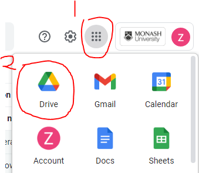
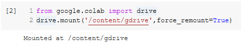
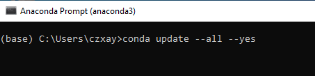
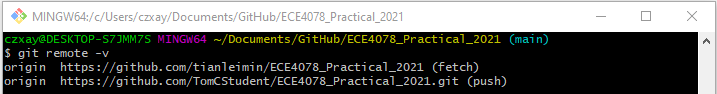

# Git Installation and basic setup

Notebooks will be made available each week before the lectures in this Github repository https://github.com/tianleimin/ECE4078_Practical_2021. You will need to install Git to access and update the notebooks before each lecture. The basic setup will ensure you get the up-to-date version for each week's content. Only attempt the Advanced part if you are experienced with Git and want to keep a copy remotely.

## Installation (Once)

1. Go [here](https://github.com/join?source=github-desktop) to create your Github account using your monash email

2. Navigate to the latest [Git for Windows installer](https://gitforwindows.org/) and download the latest version.

3. Start the installer. You should see the **Git Setup** wizard screen. Follow the **Next** and **Finish** prompts to complete the installation. Select the default options when prompted during the installation process.

4. Open a Command Prompt (or **Git Bash** if during installation you elected not to use Git from the Windows Command Prompt)

   

   

5. Run the following commands to configure your Git username and email

   `git config --global user.name "Github Username" && git config --global user.email "Github email"`

   

   for example 

   
   
   *Note: hit "Enter" to run a command.

## Repository clone and setup (Once)

These steps will download the repository on to your local device.

1. Open File Explorer and navigate to the folder in which you want to copy the repository

   *Recommended approach is to creat a folder **GitHub** in your **Documents** folder 

2. Right click and select the **Git Bash Here** option

   

3. Type `git clone https://github.com/tianleimin/ECE4078_Practical_2021` as shown below

   

4. To verify that you have setup the repository configurations correctly, type `cd ECE4078_Practical_2021/`, and then type `git remote -v`. You should see:

   

## Git pull to update your repository (Repeat weekly)

You should perform the following steps at least once a week prior to the Practical sessions

1. Open File Explorer and to to the folder in which you cloned the **Practical** repository. If you have used the recommended path, it should be Documents/GitHub/ECE4078_Practical_2021

2. Using the right click, select the **Git Bash Here** option

3. Type `git pull` as shown below, then hit "Enter".

   

# Running Jupyter Notebook on CoLab

1. Go to your student google drive, you could access it from your student email as shown below

   

2. On the top left corner, click on **New**, then choose **Folder** and name it as `ECE4078_Practical`

3. Upload your week01 folder into the folder created

4. Double click on the .ipynb file, the notebook will be opened as **Google Colaboratory** in a new tab

   

5. "Shift" + "Enter" will run a code block and advance you to the next block, repeat this step to move through the notebook. *Note: if you make changes to a code block, you should re-run that code block 

6. Please ignore these instructions, they are only applicable if you are running the Notebook locally.

   

7. After you run this code block, click on the URL link and choose your student google account

   

8. You should be given a authorization code like

   

9. Copy and past this authorization code into the text field in step 6, and hit "Enter". You should see:

   

10. You will need to edit the path if you did not follow step 2 exactly. Otherwise it should work and you should see:

   

11. *Note: hit "Ctrl" + "S" to save your changes to the notebook frequently, especially before you close it.

12. **IMPORTANT!** You need to download the edited version from google drive for submissions and updating your repository. Right click on the .ipynb file and select **Download**, then replace the local copy residing Documents/GitHub/ECE4078_Practical_2021/week01 by the edited version.

# Anaconda installation

We are going to use Anaconda, a free and open source distribution of Python, to run our Jupyter Notebooks. Follow these instructions to install Anaconda in your computer:

1. Click on this link [Anaconda Windows installation]( https://docs.anaconda.com/anaconda/install/windows/), which takes you to the official for installing Anaconda on Windows. (Instruction of installation on other OS can be accessed on the left)

2. Step 2, 12 and 14 are optional.

3. To verify your installation:

   1. Open **Anaconda Prompt** in the Windows (Start) Menu

      

   2. Type `python --version` in the command prompt, as shown below

      

   3. You will see a message indicating which version of Python has been installed

   4. To update your Anaconda installation:

      1. Open Anaconda Prompt in the Windows (Start) Menu

      2. Type `conda update --all --yes` as shown below

         

      3. Try right click on Anaconda Prompt in the Windows (Start) Menu and select "Run as administrator" if error occurred 

         

# Running Jupyter Notebook Locally

1. Open **Anaconda Navigator** in the Windows (Start) Menu

2. On the navigator window, go to the option **Jupyter Notebook** and click on **Launch**

   

   *Note: You could also find **Jupyter Notebook** in Windows (Start) Menu directly

   

3. A new tab will automatically open in your default browser

4. Go to the folder in which you previously cloned the Git repository. If you have followed the recommended instructions it should be Documents\GitHub\ECE4078_Practical_2021. Once there, select the notebook (*.ipynb files) that you will like to run

5. A new tab will automatically open in your browser. We are now ready to use the notebook.

6. Uncomment first code block, and comment out second and third code block:

   

7. You are expected to see some output related to installing Plotly (the graphics library).

   

8. "Shift" + "Enter" will run a code block and advance you to the next block, repeat this step to move through the notebook. *Note: if you make changes to a code block, you should re-run that code block 

9. *Note: hit "Ctrl" + "S" to save your changes to the notebook frequently, especially before you close it.

# Git Advanced setup

!! The advanced setup allow you to store your files both locally and remotely. You are **encouraged** to stay with **Basic setup** and only students experienced with Git should attempt this section. 

## Personal remote repository  setup (Once)

1. On your Github homepage, create a **New repository**

   

2. The **Repository name** should be `ECE4078_Practical_2021`, it should be **Private** and **none of the boxes** should be ticked

3. Open File Explorer and to to the folder in which you cloned the **Practical** repository. If you have used the recommended path, it should be Documents/GitHub/ECE4078_Practical_2021

4. Using the right click, select the **Git Bash Here** option

5. Type `git remote set-url --push origin https://github.com/GithubUsername/ECE4078_Practical_2021.git`. Please replace GitHubUsername with your username.

6. To verify that you have setup the remote repository configurations correctly, type `git remote -v` and you should see something similar to, note here the (push) url is different to the (pull) url

## Git commit and git push (At least weekly)

!! Only perform these instructions if you have done the "Personal remote repository  setup" part.

1. Open File Explorer and to to the folder in which you cloned the **Practicals** repository. If you have used the recommended path, it should be Documents/GitHub/ECE4078_Practical_2021

2. Using the right click, select the **Git Bash Here** option

3. Type `git add .`, this will stage all your modifications of files.

4. Type `git commit -m "Description of your commit"`, this will add a description about your modifications.

5. Type `git push`, this will update and synchronise your remote repository.

   

6. You might encounter this popup window, click on **Sign in with your browser** and **Authorize GitCredentialManager**

   

7. Repeat step 1-5 for any changes you want to save and upload.

## FAQs
1. Please use Jupyter NOTEBOOK, NOT Jupyter LAB for running the practicals locally
2. Please follow the instructions and naming convention when submitting your coding exercises, as they are auto-graded
3. "apps not allowed" issue with Colab:
   - Option 1: use you personal Google account
   - Option 2: opt into Google Additional services. If you choose to do so, enable the "Google Additional Services" section at [identity.monash.edu](https://identity.monash.edu/). Please note that the opt in to Google Additional services is an agreement between the user and Google directly, not Monash University
   - Option 3: delete the cookies and cache of your browser after enabling Google Additional Services and try launch Colab again
   - Option 3: upload the file whilst on the [google collaborate site](https://research.google.com/colaboratory/)
